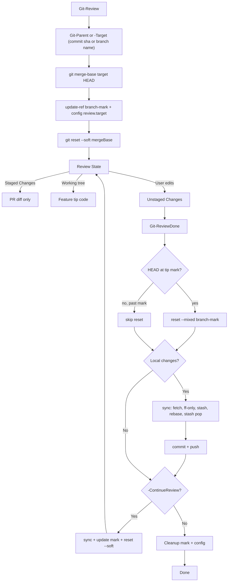

 # Local PR-Style Code Review

Replicate an Azure DevOps PR diff locally in VS Code: **Staged Changes** = your feature
changes only (merge commits excluded), **working tree** = branch tip (debuggable/runnable).

## Problem with naive `git reset --soft`

Resetting to the **current branch's creation point on target branch** (e.g. `git reset --soft <commit Sha or master>`), but not to the `merge-base`, flattens the whole branch — including everything brought in by merge commits into the staged index. You cannot tell your feature work from merged upstream changes.

> The fix is **not** “avoid `--soft`” — it is **reset to `merge-base`, not to the target tip**.

## Solution: merge-base + `reset --soft`

Azure DevOps PR review shows: `diff(merge-base(target_tip, source_tip), source_tip)`.

After saving the feature tip and moving HEAD to the merge-base:

`git reset --soft $mergeBase`

1. **HEAD** (branch pointer) → merge-base
2. **Index** → stays at feature tip (staged diff = PR diff)
3. **Working tree** → unchanged (feature tip code)

Result: VS Code **Staged Changes** = `diff(merge-base, feature-tip)` = PR diff.
Your edits during review show in **Changes** (unstaged).

### Why not `read-tree`

`git read-tree $mergeBase` loads the merge-base tree into the index, but new feature files
appear as “deleted” in staged + “untracked” in working tree — confusing in VS Code.

i.e. in below diagram, we have added new file1 in commit F, the file1 appears as deleted in staged(compare with branch head), and new file in working tree(compare with index)
### HEAD is not detached

During review you remain **on your branch** (e.g. `feature`). The branch tip was moved back
to merge-base; the real tip is stored in `{branch}-mark` until review ends.

## How it works

```
A--B--C-------D          (master / target branch)
       \       \
        \---E---\---F---Head   (your feature branch)
```

Where **F** merges **D** (master) into your branch.

1. Target = `master` (fetched if it is a local branch)
2. `git merge-base master HEAD` = **D**
3. `git update-ref feature-mark HEAD` — save tip for recovery
4. `git config --local review.target master` — persist target across terminals
5. `git reset --soft $mergeBase`

**Result:**

- **Staged Changes** = only E + post-merge feature work (F, not C/D/master-only files)
- **Working tree** = Head — runnable/debuggable
- Files identical at merge-base and tip do not appear in the diff

## Git-native state

| Item | Location |
|------|----------|
| Target branch | `git config --local review.target` → `.git/config` |
| Feature tip mark | `refs/heads/{currentBranch}-mark` |
| During review | Branch → merge-base; mark → feature tip |

## ReviewDone flow

1. **Conditional** `git reset --mixed {branch}-mark` — branch + index → feature tip unless `HEAD` is already past the mark (retry-safe after a partial sync)
2. Only your **review edits** remain unstaged
3. Optional: prompt for commit message → **sync with origin** (see below) → `git add -A` → `git commit` → `git push`
4. **`-ContinueReview`**: sync with origin, update mark, `reset --soft` to merge-base again
5. **Otherwise**: delete `{branch}-mark`, `git config --unset review.target`

### Sync with origin (`Sync-ReviewBranchWithOrigin`)

Before commit/push (and before `-ContinueReview`), `Git-ReviewDone` integrates `origin/<branch>`:

1. `git fetch origin`
2. `git merge --ff-only origin/<branch>` — succeeds when local is strictly behind remote
3. On failure: **stash** review edits → retry ff-only → **rebase** onto `origin/<branch>` if still diverged
4. **Stash pop** to restore review edits on top of the synced branch

Rebase is used on divergence (same preference as `Git-Push` / `Git-SyncParent`).

### Retry after failure

If sync or commit fails, `{branch}-mark` and `review.target` are preserved. Run `Git-ReviewDone` again:

- When `HEAD` is already **at or ahead of** the tip mark (e.g. you finished a rebase manually), `reset --mixed` is **skipped** so sync progress is not undone.
- When `HEAD` is still at the tip mark, `reset --mixed` runs as on the first attempt.

### Failure recovery

| Failure | State left | What to do |
|---------|------------|------------|
| Rebase conflict | Rebase aborted; review edits in stash | Fix upstream, `git rebase origin/<branch>`, `git stash pop`, run `Git-ReviewDone` again |
| Stash pop conflict | Branch synced; stash entry kept | Resolve working tree conflicts, then `Git-ReviewDone` again or `git stash pop` |
| Fetch / no remote ref | No sync | Fix remote/branch name, run `Git-ReviewDone` again |

### Avoid `git pull` during review

After `reset --soft`, HEAD is behind the index. `git pull` can fail or behave oddly. The
scripts use `git fetch` + sync helper (`merge --ff-only`, then rebase if needed) instead.

## State diagram



## Usage

### Start review

```powershell
Git-Review
# or:
Git-Review -Branch feature/foo -CommitFrom master
```

### Finish review

```powershell
# commit review fixes and push (prompts for message if omitted)
Git-ReviewDone -CommitMessage "review fixes"

# push then re-enter review mode on latest tip
Git-ReviewDone -ContinueReview
```

## Key commands

| Step | Command | Effect |
|------|---------|--------|
| Find base | `git merge-base $target HEAD` | Common ancestor; excludes merge noise |
| Enter review | `git reset --soft $mergeBase` | HEAD → merge-base; index/WT at feature tip |
| VS Code | Staged Changes | PR diff (feature-only) |
| VS Code | Changes | Your in-review edits (unstaged) |
| Exit review | `git reset --mixed refs/heads/{branch}-mark` (skipped if HEAD past mark) | Restore branch; review edits unstaged |
| Commit fixes | Sync helper + `git add -A` + `git commit` + `git push` | After `Git-ReviewDone` confirms |
| Re-enter | `git reset --soft $mergeBase` | With `-ContinueReview` |

## Tests

```powershell
pwsh -File Module/Metaseed.Git/ReviewCommits/_test/Test-Review.ps1
```
